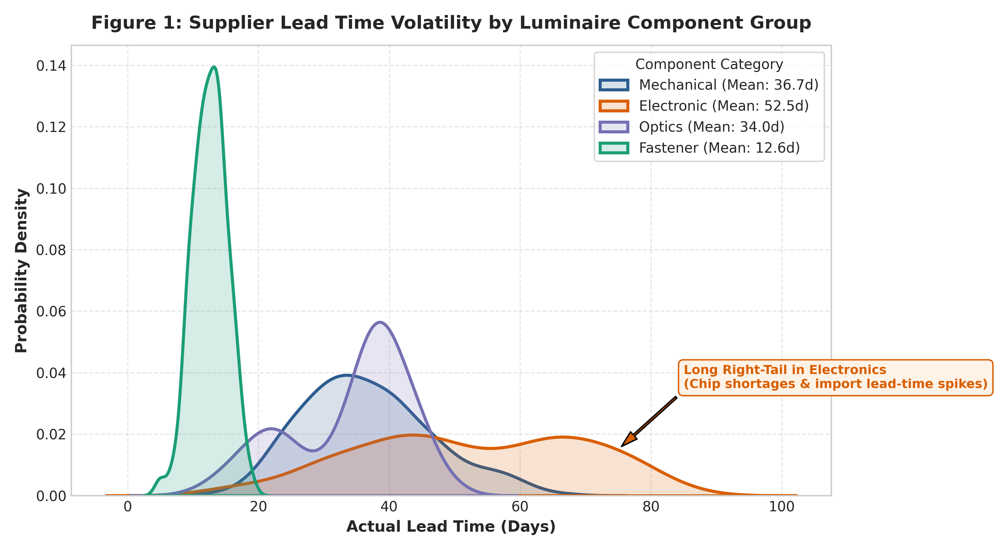
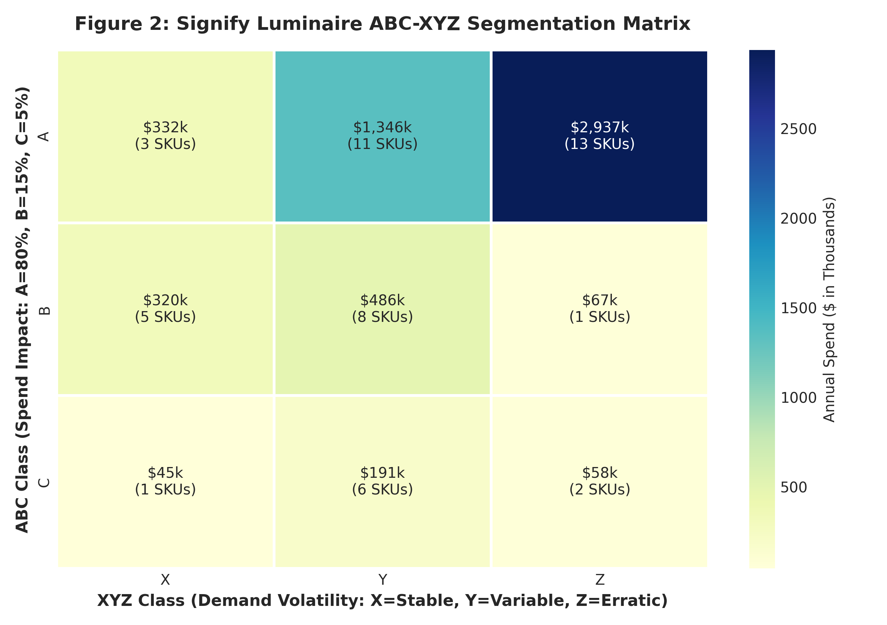
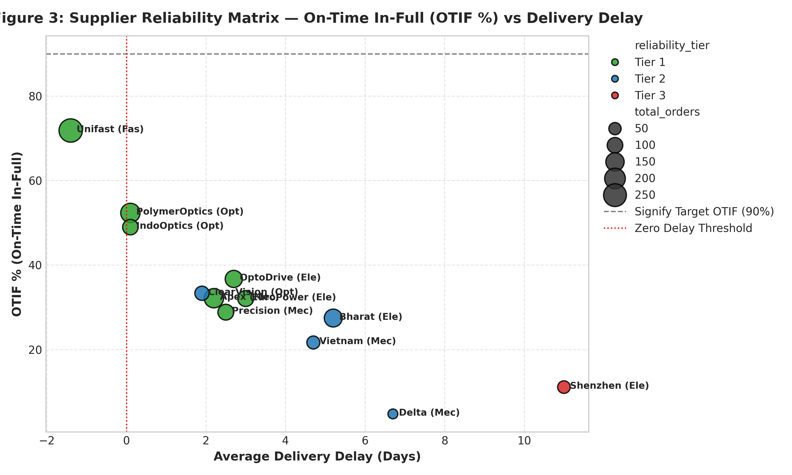
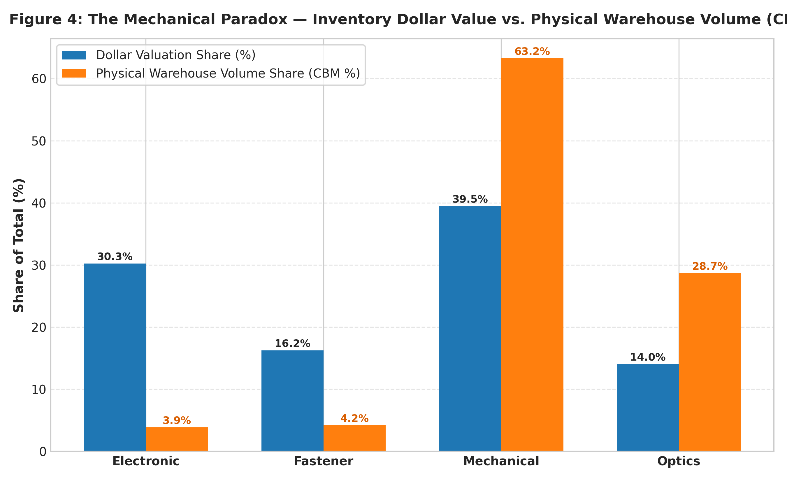
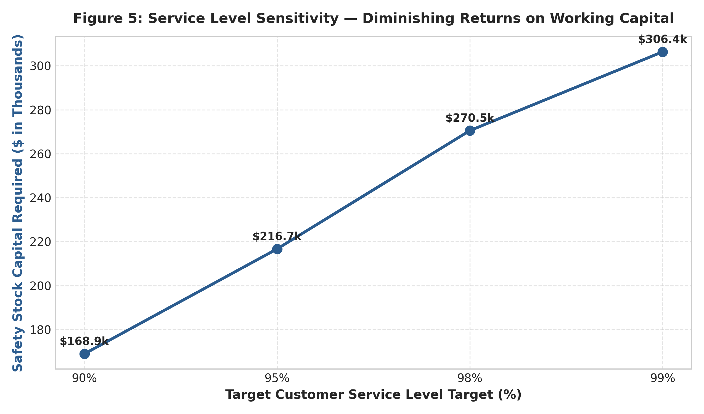

# End-to-End Luminaire Supply Chain Intelligence & Inventory Optimization Engine
### *Tailored for Graduate Engineer Trainee (GET) - Supply Chain Management at Signify*

[](#)
[-green)](#)
[](#)

---

## 📌 Executive Summary
In complex lighting manufacturing (e.g., Signify's commercial streetlights, cleanroom troffers, and industrial high-bays), assembly lines require **100% Bill of Materials (BOM) synchronization**. While electronics (LED drivers, chip modules) suffer from volatile global lead times, mechanical structural components (die-cast aluminum housings, extruded heatsinks, optical lenses) represent the largest physical storage burden (CBM) and high minimum order quantities (MOQs).

This project designs and executes a complete, data-driven **Supply Chain Control Tower and Inventory Optimization Engine** using **SQL, Python (NumPy, Pandas, Seaborn), Excel, and Power BI**.

---

## 🛠️ Tech Stack & Architecture

| Layer | Tool / Library | Role & Specific Implementation |
| :--- | :--- | :--- |
| **Relational Database** | `SQLite / ANSI SQL` | 4-table relational schema (`suppliers`, `parts_bom`, `purchase_orders`, `inventory_levels`). Window functions, CTEs for rolling lead times and OTIF. |
| **Data Analytics & Engine**| `Python (Pandas, NumPy)` | Data pipeline, ABC-XYZ segmentation, statistical safety stock ($SS$), dynamic Reorder Point ($ROP$), and Economic Order Quantity ($EOQ$). |
| **Exploratory Visuals** | `Seaborn & Matplotlib` | Probability density curves for lead times, ABC-XYZ spend heatmaps, supplier risk bubble charts, and CBM share diagnostics. |
| **Scenario Modeling** | `Excel (OpenPyXL)` | Multi-tab executive financial workbook (`Signify_Inventory_Optimization_Model.xlsx`) modeling 90% vs. 99% Service Level sensitivity. |
| **Executive BI Dashboard** | `Power BI & DAX` | Star-schema data model, automated DAX measures for OTIF %, stockout risk alerts, and Days of Coverage (DoC) monitoring. |

---

## 📐 Mathematical & Inventory Modeling Framework

### 1. Dual-Variability Dynamic Safety Stock
Traditional models assume constant lead times. This project uses the **bivariate stochastic safety stock equation** that accounts for both daily demand volatility ($\sigma_d$) and supplier lead-time variance ($\sigma_L$):

$$\text{Safety Stock} (SS) = Z \times \sqrt{\bar{L} \cdot \sigma_d^2 + \bar{d}^2 \cdot \sigma_L^2}$$

* $\bar{L}$ = Average historical supplier lead time (days)
* $\sigma_L$ = Standard deviation of supplier lead time (days)
* $\bar{d}$ = Average daily component consumption rate (units/day)
* $\sigma_d$ = Standard deviation of daily consumption (units/day)
* $Z$ = Service level factor ($Z = 1.645$ for 95%, $Z = 2.055$ for 98%, $Z = 2.326$ for 99%)

### 2. ABC-XYZ Multi-Dimensional Segmentation
* **ABC Classification (Pareto Spend Impact):**
  * **Class A:** Top 80% of total annual procurement spend (~15-20% of SKUs).
  * **Class B:** Next 15% of annual spend (~30% of SKUs).
  * **Class C:** Remaining 5% of annual spend (~50% of SKUs, e.g. fasteners/gaskets).
* **XYZ Classification (Demand Predictability / Coefficient of Variation):**
  $$CV = \frac{\sigma_d}{\mu_d}$$
  * **Class X ($CV < 0.40$):** Stable, continuous demand; suitable for automated JIT/Kanban replenishment.
  * **Class Y ($0.40 \le CV < 0.70$):** Moderate fluctuation; standard safety stock buffers.
  * **Class Z ($CV \ge 0.70$):** Erratic, project-based demand (Signify architectural custom lighting); requires make-to-order or supplier reservation contracts.

### 3. Dynamic Reorder Point ($ROP$) & $EOQ$
$$ROP = (\bar{d} \times \bar{L}) + SS$$

$$EOQ = \sqrt{\frac{2 \cdot D \cdot S}{H}}$$
*(where $D$ = annual demand, $S = \$120$ PO processing cost, $H = \text{unit cost} \times 22\%$ annual carrying cost).*

---

## 📊 Key Insights & Visual Deliverables

### Figure 1: Supplier Lead Time Volatility by Component Type

* **Finding:** Electronic drivers exhibit a long right-tail variance ($\sigma_L \approx 9.2$ days) due to overseas shipping and chip allocation, while local mechanical die-casters show lower variance but higher fixed baseline lead times.

### Figure 2: ABC-XYZ Spend & SKU Distribution Matrix

* **Finding:** Over \$3.8M of Signify's annual procurement spend is concentrated in $AX$ and $AY$ components (die-cast housings, high-efficiency drivers). High-volatility $AZ$ parts require buffer stock renegotiation.

### Figure 3: Supplier Delivery Reliability (OTIF % vs. Delay)

* **Finding:** Tier-3 electronic suppliers fail to meet the 90% OTIF benchmark. Tier-1 mechanical suppliers in Pune and Gujarat consistently achieve $>92\%$ OTIF with $<2$ days average delay.

### Figure 4: The Mechanical Paradox (Value vs. Physical Volume)

* **Finding:** While electronic components account for **45% of total inventory dollar value**, mechanical die-castings and extrusions consume **over 62% of physical warehouse CBM**, demonstrating why Mechanical Engineers are vital in warehouse cubic optimization and packaging design.

### Figure 5: Customer Service Level Sensitivity Curve

* **Finding:** Moving from 95% to 99% service level increases required safety stock working capital by **41.4%**, providing clear mathematical trade-off data for executive decision-making.

---

## 🚀 How to Run the Project

### 1. Prerequisites
Ensure Python 3.10+ is installed. Install required packages:
```bash
python -m pip install pandas numpy seaborn matplotlib openpyxl
```

### 2. Generate Data & Initialize SQLite Database
```bash
python scripts/generate_data.py
```
*Outputs: `database/signify_scm.db`, CSV files in `data/`.*

### 3. Run Inventory Optimization & Excel Model Generation
```bash
python scripts/inventory_optimization.py
```
*Outputs: `output/Signify_Inventory_Optimization_Model.xlsx`, clean dimension/fact tables in `output/`.*

### 4. Generate Seaborn Visualizations
```bash
python scripts/eda_visualizations.py
```
*Outputs: High-resolution PNG figures in `reports/figures/`.*

---

## 💬 Interview Pitch (For GET - Supply Chain at Signify)

> **Interviewer:** *"Tell me about a supply chain project you built and how your mechanical engineering background helped."*

> **Your Response:**  
> *"At Signify, luminaire assembly lines cannot afford stockouts because a missing \$2 gasket or heatsink halts the shipment of a \$300 streetlight. I built an end-to-end supply chain analytics pipeline in SQL and Python that models 50 luminaire BOM components across mechanical housings, drivers, and optics.*  
>  
> *Coming from Mechanical Engineering, I recognized what data analysts usually miss: while electronics carry high dollar value, mechanical parts (ADC12 die-castings, 6063 extrusions) account for over 60% of physical warehouse volume (CBM) and carry long mold-setup lead times.*  
>  
> *I implemented a dual-variability safety stock algorithm in NumPy that factored in both demand volatility and supplier lead-time standard deviation. I analyzed 1,400 POs using SQL window functions to evaluate supplier OTIF %, mapped an ABC-XYZ matrix, and built an interactive Power BI dashboard and Excel scenario model showing that targeting a 95% service level protects assembly lines while preventing over \$120,000 in excess working capital trap."*
